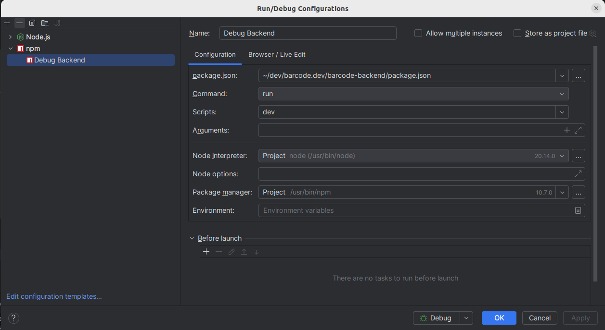

# LIL backend

## Install Prisma
https://www.prisma.io/docs/prisma-orm/quickstart/mysql

To create a new migration without applying:
```
npx prisma migrate dev --name test --create-only
```
To apply it then:
```
npx prisma migrate dev
```

## Install Express
https://expressjs.com/en/starter/hello-world.html

## Install Apollo Server
https://www.apollographql.com/docs/apollo-server/getting-started

## Install photos
https://pothos-graphql.dev/docs
https://pothos-graphql.dev/docs/plugins/prisma/setup

### Plugins
- validation plugin :
  - https://pothos-graphql.dev/docs/plugins/validation
  - https://pothos-graphql.dev/docs/plugins/zod
- auth plugin : https://pothos-graphql.dev/docs/plugins/scope-auth

## Debug
This is the debug configuration for IntelliJ:

